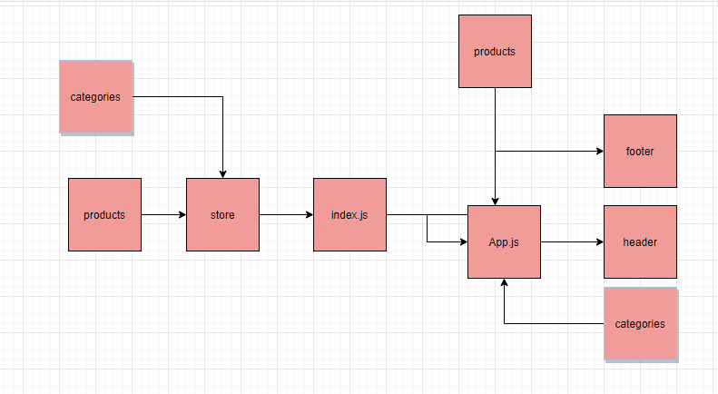

# storefront

## Description

* Build of the storefront application, written in React.
* setup the basic scaffolding of the application with initial styling and basic behaviors. 
* This initial build sets up the file structure and state management so that we can progressively build this application in a scalable manner

- list of available product categories in the store so that I can easily browse products
- choose a category and see a list of all available products matching that category
- easy to use user interface so that I can shop the online store with confidence

## sandbox Links

https://codesandbox.io/s/blissful-shtern-xdylz

## Pull Request Links: 

https://github.com/baraahalomari/storefront/pull/1

## UML

